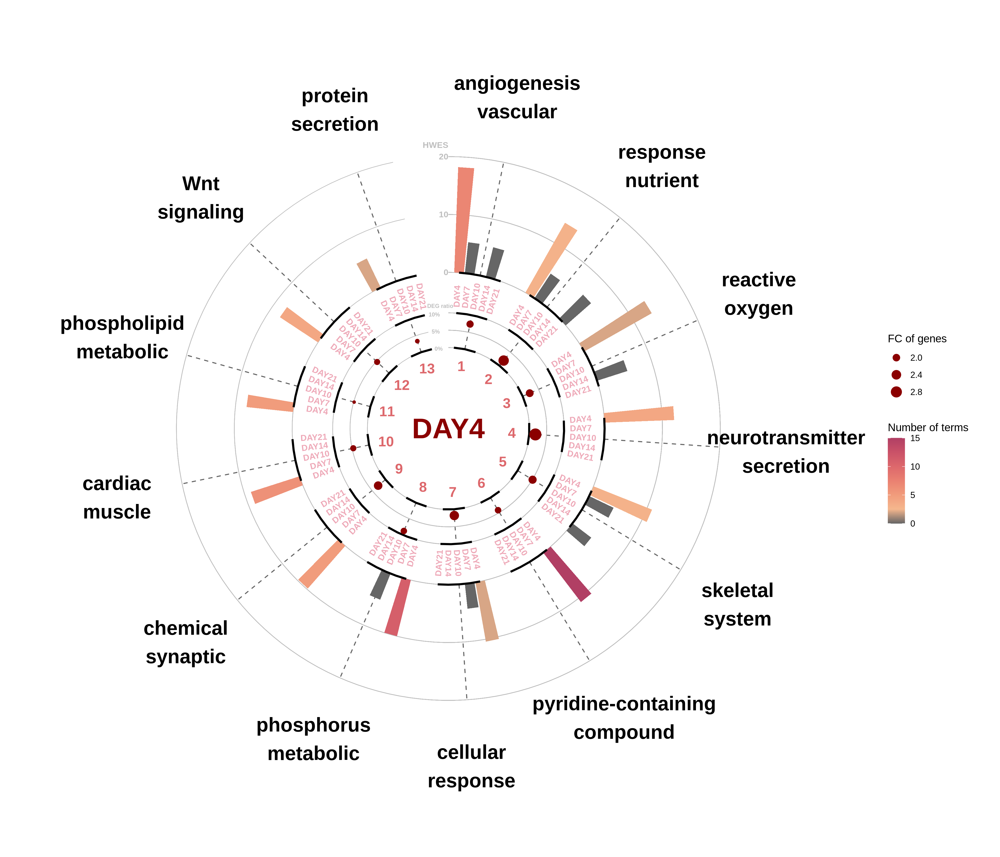
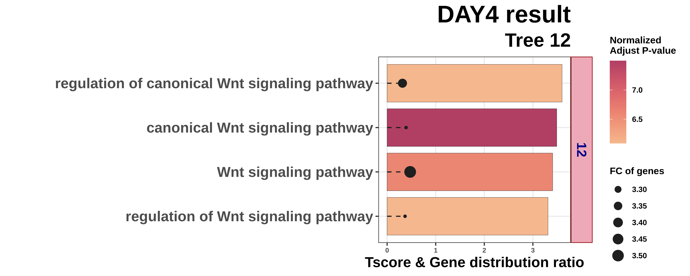
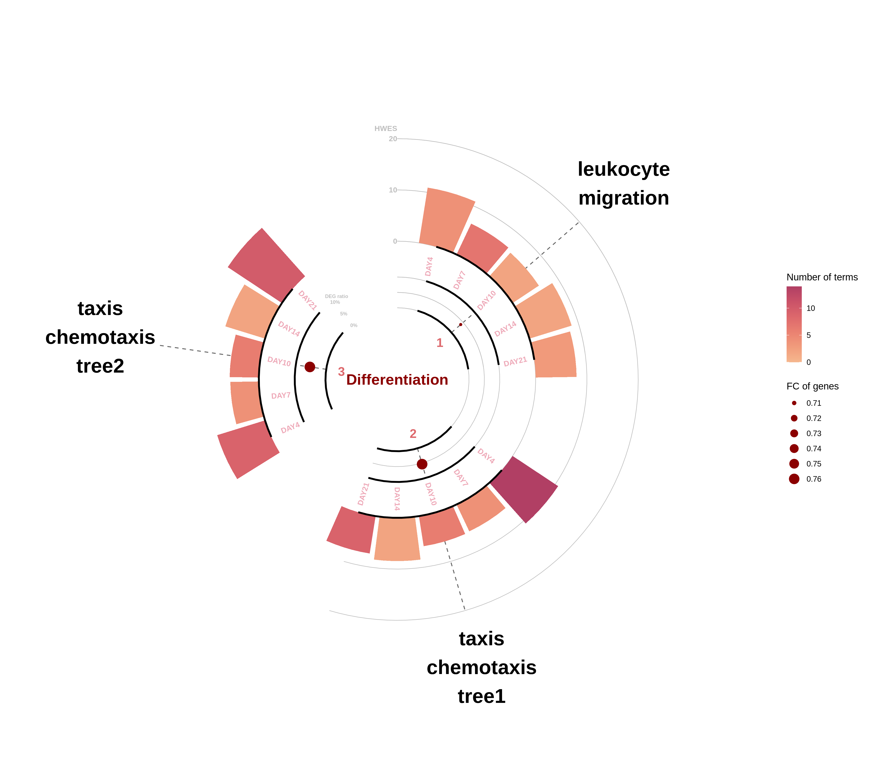
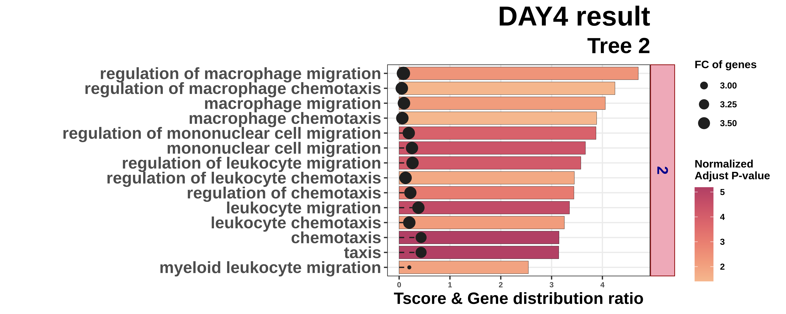
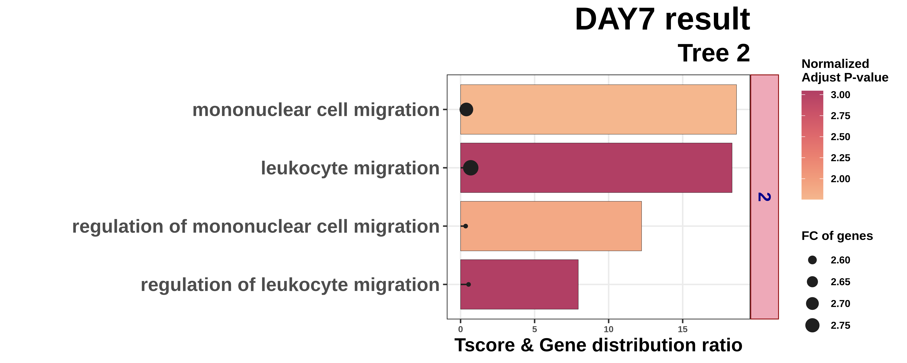
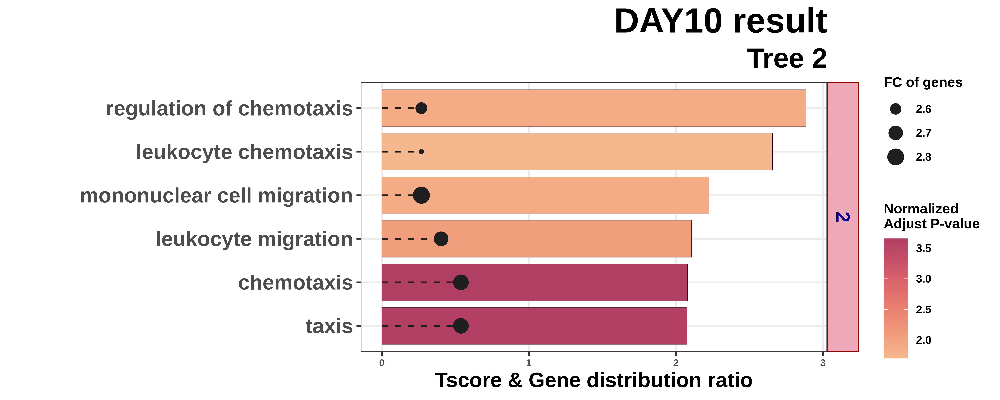
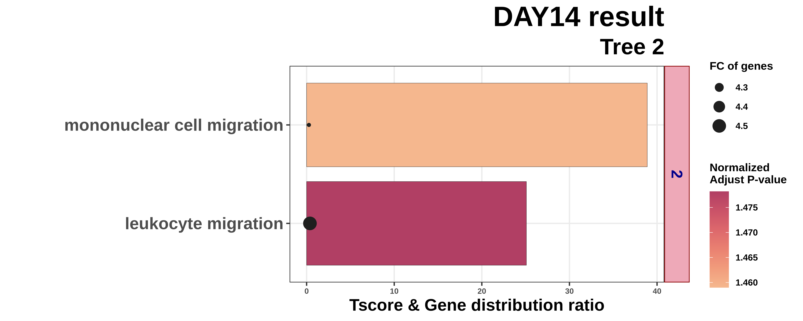
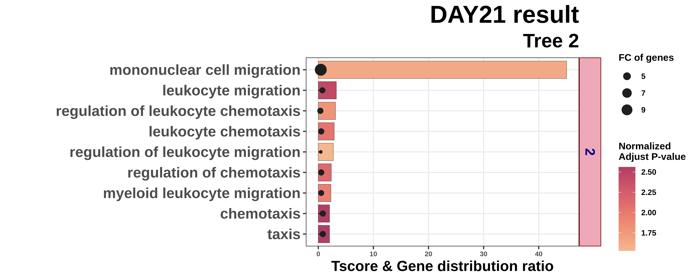

```{r, include = FALSE}
knitr::opts_chunk$set(
  collapse = TRUE,
  comment = "#>"
)
```

```{css, echo=FALSE}
pre {
  margin-top: 0.8rem;
  margin-bottom: 1.6rem;
}

.sourceCode {
  margin-bottom: 1.6rem;
}
```
## R code

### 0. Multiple-case preprocessing & analysis
The visualizations below assume a completed multiple-case analysis. First run:

```{r, eval=FALSE}
HARMONIC_ANALYSIS(filepath = "../HARMONIC_DIFF/HARMONIC/",
                  type = "standard",
                  full_condition = c("DAY0","DAY4","DAY7","DAY10","DAY14","DAY21"),
                  number_of_rep = c(3, 3, 3, 6, 3, 3),
                  DEG_list_name = "input_DEG_list.txt",
                  mango_design = c("DAY4_DAY0_UP","DAY7_DAY4_UP","DAY10_DAY7_UP","DAY14_DAY10_UP","DAY21_DAY14_UP"),
                  core = 5,
                  ref_genome = "mm",
                  PASSED_RATIO = 15,   
                  PASSED_NUM = 2,      
                  similarity = 90,     
                  FC = 2,           
                  condition = c(1,4),
                  dynamic_analyisis = "T", 
                  preprocessing = "F")
```

### 1. Heatmap

`HARMONIC_HeatMap()` visualizes active trees across multiple conditions as a
grid. Each row is an active tree and each column is a condition (comparison);
a filled cell indicates the tree was detected in that condition, revealing
common versus condition-specific patterns. Key parameters:

- `filepath` — path to the multiple-case analysis output directory
- `DEG_list_name` — file name of the input DEG list
- `trends` — direction of change to plot (`"UP"` or `"DOWN"`)
- `condition` — which trees to show: `"ALL"` (all active trees) or `"SIG"` (significant trees only)
- `width`, `height` — output figure size (in inches)
- `max` — upper limit of the color scale
- `dynamic_analyisis` — whether to restrict to dynamic-analysis trees (`"T"`/`"F"`)

**All trees (`condition = "ALL"`):**

```{r, eval=FALSE}
HARMONIC_HeatMap(filepath = "/data3/psg/NGS_2026/gitHARMONIC/HARMONIC_DIFF/HARMONIC_ALL/",
                 DEG_list_name = "input_DEG_list.txt",
                 trends = "UP",
                 condition = "ALL",
                 width = 5,
                 height = 10,
                 max = 10,
                 dynamic_analyisis = "F")
```

```{r, echo=FALSE, out.width="100%"}
knitr::include_graphics("figures/vis-multi-heatmap-all.png")
```

**Significant trees only (`condition = "SIG"`):**

```{r, eval=FALSE}
HARMONIC_HeatMap(filepath = "/data3/psg/NGS_2026/gitHARMONIC/HARMONIC_DIFF/HARMONIC_ALL/",
                 DEG_list_name = "input_DEG_list.txt",
                 trends = "UP",
                 condition = "SIG",
                 width = 5,
                 height = 10,
                 max = 10,
                 dynamic_analyisis = "F")
```

```{r, echo=FALSE, out.width="100%"}
knitr::include_graphics("figures/vis-multi-heatmap-sig.png")
```

**Dynamic-analysis trees (`dynamic_analyisis = "T"`):**

Enabling `dynamic_analyisis` restricts the heatmap to trees that are commonly
detected across the specified range of conditions, highlighting processes that
are consistently active along the trajectory. Note the much smaller number of
rows compared to the full heatmap above.

```{r, eval=FALSE}
HARMONIC_HeatMap(filepath = "/data3/psg/NGS_2026/gitHARMONIC/HARMONIC_DIFF/HARMONIC_ALL/",
                 DEG_list_name = "input_DEG_list.txt",
                 trends = "UP",
                 condition = "ALL",
                 width = 5,
                 height = 3,
                 max = 10,
                 dynamic_analyisis = "T")
```

```{r, echo=FALSE, out.width="100%"}
knitr::include_graphics("figures/vis-multi-heatmap-dynamic.png")
```

### 2.1. Tree plot ver.Specific

`HARMONIC_TREE_cirPLOT_forMULTI()` shows the active trees of a multiple-case
analysis in a circular layout, where each wedge is a tree and the concentric
rings represent the successive conditions (e.g. DAY4 → DAY21). This reveals how
each tree's signal changes across the trajectory. Key parameters:

- `filepath` — path to the multiple-case analysis output directory
- `DEG_list_name` — file name of the input DEG list
- `status` — which trees to show (`"specific"` for condition-specific trees)
- `trends` — direction of change (`"UP"` or `"DOWN"`)
- `LABEL` — condition labels, in order
- `project` — project name shown at the plot center
- `condition` — reference condition index
- `tree_size`, `label_size`, `project_size` — font/element sizes
- `width`, `height` — output figure size (in inches)

```{r, eval=FALSE}
HARMONIC_TREE_cirPLOT_forMULTI(filepath = "../HARMONIC_DIFF/HARMONIC/",
                               DEG_list_name = "input_DEG_list.txt",
                               status = "specific",
                               trends = "UP",
                               LABEL = c("DAY4","DAY7","DAY10","DAY14","DAY21"),
                               project = "Differentiation",
                               condition = 1,
                               tree_size = 7,
                               label_size = 3,
                               project_size = 10,
                               width = 14,
                               height = 12)
```

```{r, echo=FALSE, out.width="100%"}

```

### 2.2. Term plot ver.Specific

`HARMONIC_TERM_barPLOT_forMULTI()` expands a selected tree (via `clusternum`)
into its individual GO terms for the multiple-case design, showing each term's
Tscore and gene distribution ratio.

- `status` — which trees to show (`"specific"`)
- `condition` — reference condition index
- `clusternum` — the tree number to expand (matches the tree plot)

```{r, eval=FALSE}
HARMONIC_TERM_barPLOT_forMULTI(filepath = "../HARMONIC_DIFF/HARMONIC/",
                               DEG_list_name = "input_DEG_list.txt",
                               status = "specific",
                               trends = "UP",
                               LABEL = c("DAY4","DAY7","DAY10","DAY14","DAY21"),
                               condition = 1,
                               clusternum = 12,
                               width = 10,
                               height = 4)
```

```{r, echo=FALSE, out.width="100%"}

```

### 3.1. Tree plot ver.Common

Setting `status = "common"` shows the active trees that are **shared across all
conditions**, complementing the condition-specific view in section 2. The
circular layout again stacks the successive conditions as concentric rings.

```{r, eval=FALSE}
HARMONIC_TREE_cirPLOT_forMULTI(filepath = "../HARMONIC_DIFF/HARMONIC/",
                               DEG_list_name = "input_DEG_list.txt",
                               status = "common",
                               trends = "UP",
                               LABEL = c("DAY4","DAY7","DAY10","DAY14","DAY21"),
                               project = "Differentiation",
                               condition = 1,
                               tree_size = 8,
                               label_size = 3,
                               project_size = 6,
                               width = 14,
                               height = 12)
```

```{r, echo=FALSE, out.width="100%"}

```

### 3.2. Term plot ver.Common

For a common tree (here `clusternum = 2`), the term plot can be drawn for each
condition in turn (`condition = 1` through `5`, i.e. DAY4 → DAY21), letting you
compare how the same tree's GO terms behave across the trajectory.

```{r, eval=FALSE}
HARMONIC_TERM_barPLOT_forMULTI(filepath = "../HARMONIC_DIFF/HARMONIC/",
                               DEG_list_name = "input_DEG_list.txt",
                               status = "common",
                               trends = "UP",
                               LABEL = c("DAY4","DAY7","DAY10","DAY14","DAY21"),
                               condition = 1,
                               clusternum = 2,
                               width = 10,
                               height = 4)
}
```

```{r, echo=FALSE, out.width="100%"}

```

```{r, eval=FALSE}
HARMONIC_TERM_barPLOT_forMULTI(filepath = "../HARMONIC_DIFF/HARMONIC/",
                               DEG_list_name = "input_DEG_list.txt",
                               status = "common",
                               trends = "UP",
                               LABEL = c("DAY4","DAY7","DAY10","DAY14","DAY21"),
                               condition = 2,
                               clusternum = 2,
                               width = 10,
                               height = 4)
}
```

```{r, echo=FALSE, out.width="100%"}

```

```{r, eval=FALSE}
HARMONIC_TERM_barPLOT_forMULTI(filepath = "../HARMONIC_DIFF/HARMONIC/",
                               DEG_list_name = "input_DEG_list.txt",
                               status = "common",
                               trends = "UP",
                               LABEL = c("DAY4","DAY7","DAY10","DAY14","DAY21"),
                               condition = 3,
                               clusternum = 2,
                               width = 10,
                               height = 4)
}
```

```{r, echo=FALSE, out.width="100%"}

```

```{r, eval=FALSE}
HARMONIC_TERM_barPLOT_forMULTI(filepath = "../HARMONIC_DIFF/HARMONIC/",
                               DEG_list_name = "input_DEG_list.txt",
                               status = "common",
                               trends = "UP",
                               LABEL = c("DAY4","DAY7","DAY10","DAY14","DAY21"),
                               condition = 4,
                               clusternum = 2,
                               width = 10,
                               height = 4)
}
```

```{r, echo=FALSE, out.width="100%"}

```

```{r, eval=FALSE}
HARMONIC_TERM_barPLOT_forMULTI(filepath = "../HARMONIC_DIFF/HARMONIC/",
                               DEG_list_name = "input_DEG_list.txt",
                               status = "common",
                               trends = "UP",
                               LABEL = c("DAY4","DAY7","DAY10","DAY14","DAY21"),
                               condition = 5,
                               clusternum = 2,
                               width = 10,
                               height = 4)
}
```

```{r, echo=FALSE, out.width="100%"}

```
