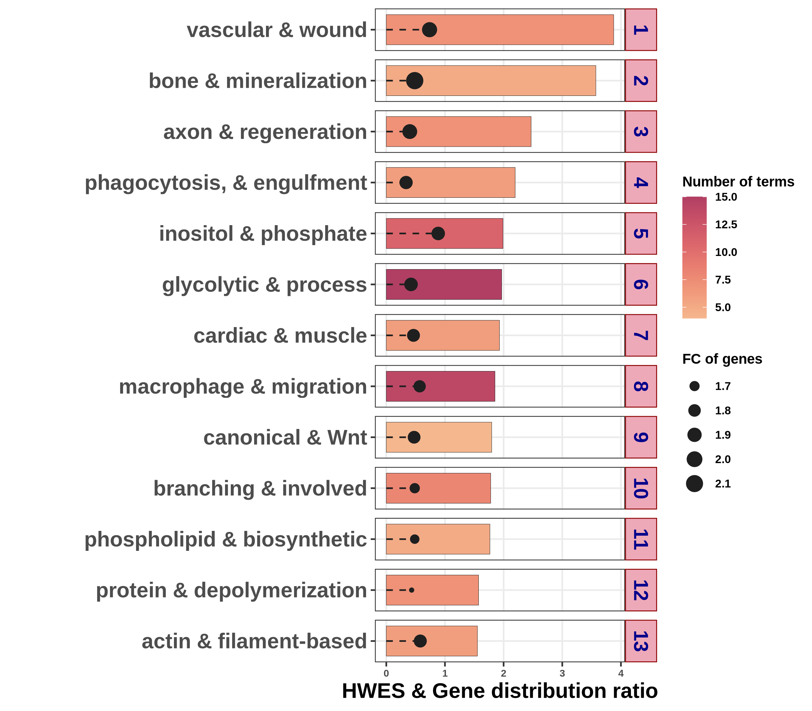
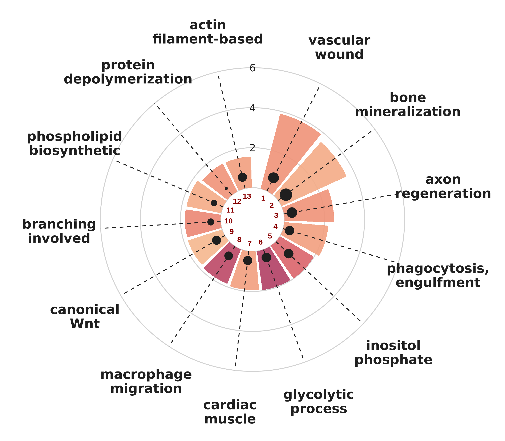

```{r, include = FALSE}
knitr::opts_chunk$set(
  collapse = TRUE,
  comment = "#>"
)
```

```{css, echo=FALSE}
pre {
  margin-top: 0.8rem;
  margin-bottom: 1.6rem;
}

.sourceCode {
  margin-bottom: 1.6rem;
}
```
## R code

### 0. Single-case preprocessing & analysis
The visualizations below assume a completed single-case analysis. First run:

```{r, eval=FALSE}
HARMONIC_ANALYSIS(filepath = "../HARMONIC_DIFF/HARMONIC/",
                  type = "standard",
                  full_condition = c("DAY0","DAY4","DAY7","DAY10","DAY14","DAY21"),
                  number_of_rep = c(3, 3, 3, 6, 3, 3),
                  DEG_list_name = "input_DEG_list.txt",
                  mango_design = c("DAY4_DAY0_UP"),
                  core = 1,
                  ref_genome = "mm",
                  PASSED_RATIO = 25,   
                  PASSED_NUM = 3,      
                  similarity = 50,     
                  preprocessing = "F")
```

### 1.1. Tree plot ver. BAR

`HARMONIC_TREE_PLOT_forSINGLE()` summarizes the active trees from a single-case
analysis, showing each tree's HWES and gene distribution ratio alongside its
representative biological process. Key parameters:

- `filepath` — path to the analysis output directory for the comparison of interest
- `trends` — direction of change to plot (`"UP"` or `"DOWN"`)
- `width`, `height` — output figure size (in inches)
- `plot` — plot style (`"bar"` for the bar summary shown below)
- `DEG_list_name` — file name of the input DEG list

```{r, eval=FALSE}
HARMONIC_TREE_PLOT_forSINGLE(filepath = "../HARMONIC_DIFF/HARMONIC/",
                             trends = "UP",
                             width = 8,
                             height = 7,
                             plot = "bar",
                             DEG_list_name = "input_DEG_list.txt")
```

```{r, echo=FALSE, out.width="100%"}

```


### 1.2. Tree plot ver. CIR

Setting `plot = "cir"` renders the same active-tree summary in a circular
(polar) layout. Each wedge is one active tree, arranged radially and labeled by
its representative biological process, with tree numbers shown at the center.

```{r, eval=FALSE}
HARMONIC_TREE_PLOT_forSINGLE(filepath = "../HARMONIC_DIFF/HARMONIC/",
                             trends = "UP",
                             width = 8,
                             height = 7,
                             plot = "cir",
                             DEG_list_name = "input_DEG_list.txt")
```

```{r, echo=FALSE, out.width="100%"}

```
